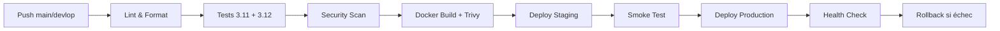

<p align="center">
  
  
  
  <br>
  
  
  
  
  
  <br>
  
  
  
  
  
  
  
  <br>
  
  
  
</p>

<h1 align="center">GenAI Platform</h1>

<p align="center">
  Plateforme GenAI industrialisée — MLOps, RAG, agents conversationnels, monitoring & sécurité
</p>

---

## À propos

**GenAI Platform** est une plateforme de production pour applications LLM, construite sur **FastAPI**. Elle intègre un pipeline RAG complet (découpage sémantique, BM25, reranking), un gateway LLM avec circuit breaker et fallback multi-modèle, des garde-fous entrée/sortie (injection, toxicité, PII), du caching sémantique, du rate limiting, et de l'observabilité complète (Langfuse, Prometheus, MLflow).

### Topics

`genai`, `llm`, `rag`, `fastapi`, `mlops`, `guardrails`, `semantic-cache`, `circuit-breaker`, `langfuse`, `prometheus`, `qdrant`, `redis`, `postgresql`, `mlflow`, `docker`, `kubernetes`, `github-actions`, `production-ready`

### Architecture (12 couches)

| Couche | Technologie | Rôle |
|--------|-------------|------|
| 01 — Infrastructure | Docker Compose, K8s | Orchestration conteneurs |
| 02 — Données | Qdrant, Redis, PostgreSQL | Vector store, cache, métadonnées |
| 03 — Gateway LLM | LiteLLM | Routage, fallback, circuit breaker |
| 04 — RAG | Chunking, BM25, reranker | Recherche et génération augmentée |
| 05 — Guardrails | Guardrails AI | Sécurité entrée/sortie |
| 06 — Monitoring | Langfuse, Prometheus | Traces, métriques, alerting |
| 07 — Industrialisation | CI/CD, Trivy, detect-secrets | Qualité et sécurité continue |
| 08 — Feedback & Eval | RAGAS, DeepEval | Évaluation de la qualité RAG |
| 09 — Sécurité & RGPD | Presidio, rate limiting | Conformité et protection |
| 10 — Tests | pytest, mypy, ruff | Fiabilité du code |
| 11 — Prompt Registry | Gestion centralisée | Versioning des prompts |
| 12 — Load & Chaos | Tests de charge | Résilience |

## Fonctionnalités

- **API REST** — endpoints `/api/v1/query`, `/api/v1/models`, `/api/v1/documents`
- **RAG pipeline** — chunking intelligent, BM25, reranking, embeddings OpenAI/ mock
- **LLM Gateway** — circuit breaker, fallback automatique, support multi-modèle
- **Guardrails** — détection d'injection, toxicité, PII (Presidio)
- **Caching sémantique** — cache Redis avec similarité cosinus
- **Rate limiting** — RPM + TPM par client
- **Multi-tenant** — isolation par en-tête `X-Tenant-Id`
- **Authentification** — API key via en-tête `Authorization`
- **Observabilité** — Langfuse pour le tracing, Prometheus pour les métriques
- **MLflow** — tracking des expériences et des modèles

## Démarrage rapide

```bash
# 1. Cloner le dépôt
git clone <url-du-repo>
cd genai-platform

# 2. Démarrer la stack de services
make docker-up          # Qdrant + Redis + PostgreSQL + MLflow + Langfuse

# 3. Initialiser l'environnement
make init               # .venv + dépendances + pre-commit hooks

# 4. Copier et configurer les variables d'environnement
cp .env.example .env

# 5. Lancer l'API
uvicorn genai_platform.adapters.http.api:app --reload
```

L'API est disponible sur `http://localhost:8000`. Documentation interactive sur `/docs`.

## Commandes Make

| Commande | Description |
|----------|-------------|
| `make init` | Environnement complet (.venv + deps + pre-commit) |
| `make lint` | Ruff check |
| `make typecheck` | Mypy strict |
| `make test` | Tests unitaires avec coverage |
| `make build` | Lint + typecheck + test |
| `make docker-up` | Stack complète (Qdrant, Redis, Postgres, MLflow, Langfuse) |
| `make docker-down` | Arrêt + nettoyage volumes |
| `make security` | detect-secrets + pip-audit |
| `make format` | Ruff format |

## Stack technique

- **Langage** : Python 3.11+
- **Framework** : FastAPI 0.115+, Pydantic 2.10+
- **LLM** : LiteLLM 1.60+ (multi-provider)
- **Vector store** : Qdrant 1.13+
- **Cache** : Redis 7.4+ (stockage + caching sémantique)
- **Base de données** : PostgreSQL 16 (MLflow, Langfuse)
- **MLflow** : Tracking d'expériences 2.20+
- **Observabilité** : Langfuse 3.50+, Prometheus
- **Sécurité** : Guardrails AI, Presidio, rate limiting
- **CI/CD** : GitHub Actions (lint → test → security → docker)
- **Conteneurisation** : Docker, Docker Compose, K8s (blue/green)

## Pipeline CI/CD



## Documentation

La documentation détaillée de l'architecture (12 couches) se trouve dans `docs/couche-*.md` (FR). Les décisions d'architecture sont documentées dans `docs/adr/`.

## Licence

Propriétaire — usage interne.
